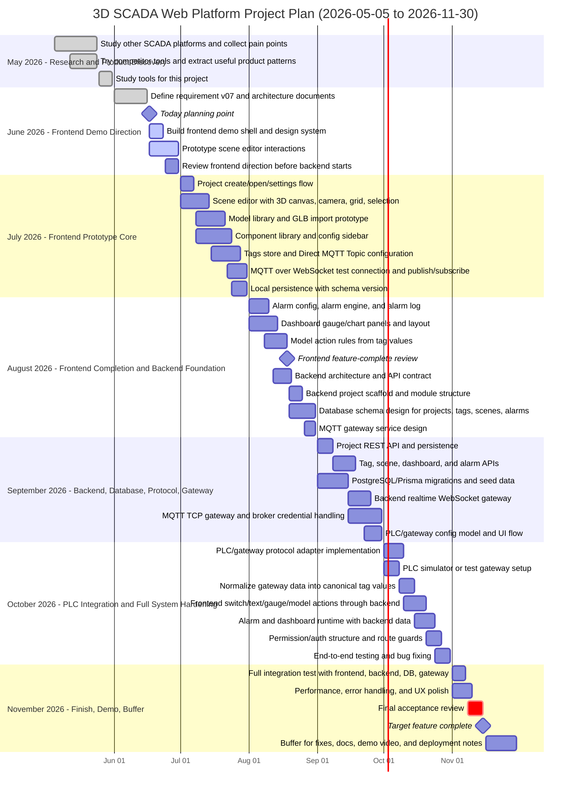

# 07 - Project Gantt Chart

## Purpose

This document defines the working timeline for the 3D SCADA Web Platform from
2026-05-05 to 2026-11-30.

The target is to finish the complete project scope by the second week of
November 2026, then keep the last half of November as buffer for fixes,
stabilization, documentation, and demo preparation.

## Date Anchors

| Item | Date |
|---|---|
| Project timeline starts | 2026-05-05 |
| Current planning date | 2026-06-17 |
| Target feature complete | 2026-11-15 |
| Final buffer ends | 2026-11-30 |

## Scope Covered

This Gantt covers the full project direction, not only the current
frontend-only Version 07 prototype.

Included by the end of the project:

- Frontend SCADA/HMI editor
- 3D scene editor
- Model/component placement
- Tag configuration
- MQTT Direct Topic protocol
- Backend API
- Database persistence
- Project/config management
- Gateway configuration
- PLC/gateway protocol integration
- Alarm and dashboard runtime
- Integration testing, documentation, and demo readiness

## Mermaid Gantt

## Weekly Plan

| Week | Dates | Main Goal | Expected Output |
|---|---|---|---|
| W1 | 2026-05-05 to 2026-05-10 | Study SCADA competitors | Initial notes, strengths, weak points |
| W2 | 2026-05-11 to 2026-05-17 | Try competitor products | Pain points and useful interaction patterns |
| W3 | 2026-05-18 to 2026-05-24 | Convert research into product direction | Feature ideas and anti-pattern list |
| W4 | 2026-05-25 to 2026-05-31 | Study project tools | Tool choice notes for frontend, design, docs |
| W5 | 2026-06-01 to 2026-06-07 | Requirement and architecture setup | Requirement v07 and project direction |
| W6 | 2026-06-08 to 2026-06-14 | Agent skill, docs, design references | Skill/doc structure ready |
| W7 | 2026-06-15 to 2026-06-21 | Frontend demo shell | App shell, layout, theme, navigation |
| W8 | 2026-06-22 to 2026-06-30 | Scene editor demo direction | Drag/drop, select, move, resize, copy/paste |
| W9 | 2026-07-01 to 2026-07-07 | Project/settings flow | Create/open/settings prototype |
| W10 | 2026-07-08 to 2026-07-14 | Scene editor core | 3D canvas, grid, camera, selection |
| W11 | 2026-07-15 to 2026-07-21 | Models and components | GLB import prototype and SCADA components |
| W12 | 2026-07-22 to 2026-07-31 | Tags, MQTT WebSocket, persistence | Direct MQTT Topic and local save/load |
| W13 | 2026-08-01 to 2026-08-07 | Alarm and dashboard foundation | Alarm rules, log table, dashboard panels |
| W14 | 2026-08-08 to 2026-08-14 | Model actions and dashboard polish | Tag-driven model action prototype |
| W15 | 2026-08-15 to 2026-08-21 | Frontend complete review and backend plan | Frontend review, API contract |
| W16 | 2026-08-22 to 2026-08-31 | Backend and DB foundation | Backend scaffold, DB schema, gateway design |
| W17 | 2026-09-01 to 2026-09-07 | Project API and DB migrations | Project persistence API |
| W18 | 2026-09-08 to 2026-09-14 | Feature APIs | Tags, scenes, dashboard, alarms API |
| W19 | 2026-09-15 to 2026-09-21 | Realtime backend | WebSocket gateway and MQTT TCP gateway |
| W20 | 2026-09-22 to 2026-09-30 | Gateway/PLC config | Gateway config model and UI flow |
| W21 | 2026-10-01 to 2026-10-07 | PLC adapter and simulator | Testable PLC/gateway adapter path |
| W22 | 2026-10-08 to 2026-10-14 | Canonical tag normalization | Gateway data becomes tag values |
| W23 | 2026-10-15 to 2026-10-21 | Frontend-backend runtime integration | Controls, values, alarms, dashboard connected |
| W24 | 2026-10-22 to 2026-10-31 | Auth/permissions and E2E hardening | Route guards, permissions, bug fixes |
| W25 | 2026-11-01 to 2026-11-07 | Full system integration test | Frontend + backend + DB + gateway verified |
| W26 | 2026-11-08 to 2026-11-15 | Final acceptance | Feature complete by second week of November |
| W27 | 2026-11-16 to 2026-11-22 | Buffer 1 | Fixes, docs, deployment notes |
| W28 | 2026-11-23 to 2026-11-30 | Buffer 2 | Demo, final cleanup, fallback time |

## Milestones

| Milestone | Target Date | Definition of Done |
|---|---|---|
| Research complete | 2026-05-31 | Competitor SCADA study and tool study are summarized |
| Frontend direction validated | 2026-06-30 | Demo frontend shows core editor direction |
| Frontend prototype feature complete | 2026-08-18 | Project, scene, tags, MQTT WebSocket, alarms, dashboard are reviewable |
| Backend foundation ready | 2026-08-31 | Backend scaffold, API contract, DB schema, gateway design are ready |
| Backend + DB usable | 2026-09-18 | Project/tag/scene/alarm/dashboard APIs persist data |
| Gateway path ready | 2026-09-30 | MQTT TCP gateway and PLC config model are ready for integration |
| PLC/gateway integration ready | 2026-10-15 | Gateway data is normalized into canonical tag values |
| Full runtime connected | 2026-10-24 | Scene, dashboard, alarms, and controls read/write through backend runtime |
| Feature complete | 2026-11-15 | Frontend, protocol, backend, DB, gateway config, and PLC integration pass acceptance |
| Final buffer complete | 2026-11-30 | Docs, demo, cleanup, and final fixes are complete |

## Risk Controls

| Risk | Mitigation |
|---|---|
| PLC/gateway pattern changes late | Keep PLC as protocol adapter and normalize to canonical tags |
| Backend starts before frontend direction is clear | Finish frontend demo direction by 2026-06-30 |
| Direct MQTT and PLC gateway logic mix together | Keep protocol modules separate and make scene/dashboard/alarm read tags only |
| Database schema changes too often | Use schema versioning and migrations from the first backend phase |
| November becomes too rushed | Treat 2026-11-15 as feature-complete deadline and protect 2026-11-16 to 2026-11-30 as buffer |

## Review Rule

At the end of every week, update this file with:

- Completed work
- Delayed work
- Requirement changes
- Scope moved into or out of the plan
- New risks
- Next week's target

